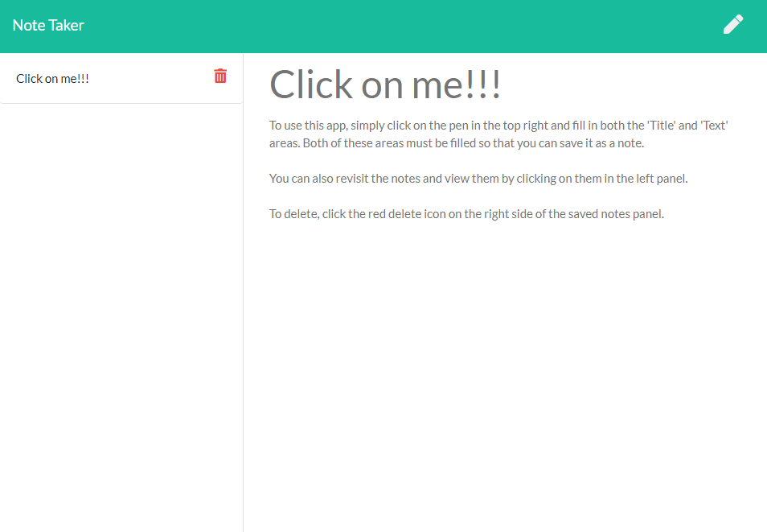

# Note-Taker

  

  ## Table of Contents

    * [Description](#description) 

    * [Installation](#installation) 

    * [Usage](#usage) 

    * [Contributing](#contributing) 

    * [Test](#test) 

    * [Credits](#credits) 

    * [License](#license) 

    * [Questions](#questions) 

  ## Description:
  

    This app is deployed with Heroku CLI. The purpose of this app is to allow users to save, view, and delete notes. The Note Taker app is run on an express server that use the GET, POST, DELETE methods to fulfill the functionality of the app. To save a note, click on the edit icon in the top right corner of the app, fill both the title and text areas. To save, both of the textareas must be filled in order for the save icon to appear on the left of the edit icon. After saving the note can be viewed on the left panel where the title of the note is displayed in a list of all other saved notes. To delete, hover over the note that you want to delete and click on the red trash icon. All of these functions rewrite and edit to a JSON file that holds an array of saved notes.
  ## Installation: 
    Install the dependencies: npm install express fs path moment
  ## Usage:
    To use the app, you can fork the repo and install the dependencies listed above and use the cmd line 'node server.js' in your preferred terminal. This is how you would use it if you want the source code for personal use. Alternatively, you can instead click on the link above to the deployed herokue app and use it how you please. 
  ## Contributing: 
    Code referenced: Plover Brown, Clyde Baron Rapinan, Jeneth Diesta. All have very interesting coding styles and viewing their code helps me learn a lot about different approaches. Here are other programmers that I personally think write very efficient code that suits my own style as well.
  ## Test: 
    N/A
  ## License:  

  This project is protected under the [MIT](https://opensource.org/licenses/MIT) license. Use is encouraged as outlined in this license.

  ## Questions: 
  For questions about the project go to my GitHub page at:

    * [GitHub Profile](https://github.com/Nardacyon)
